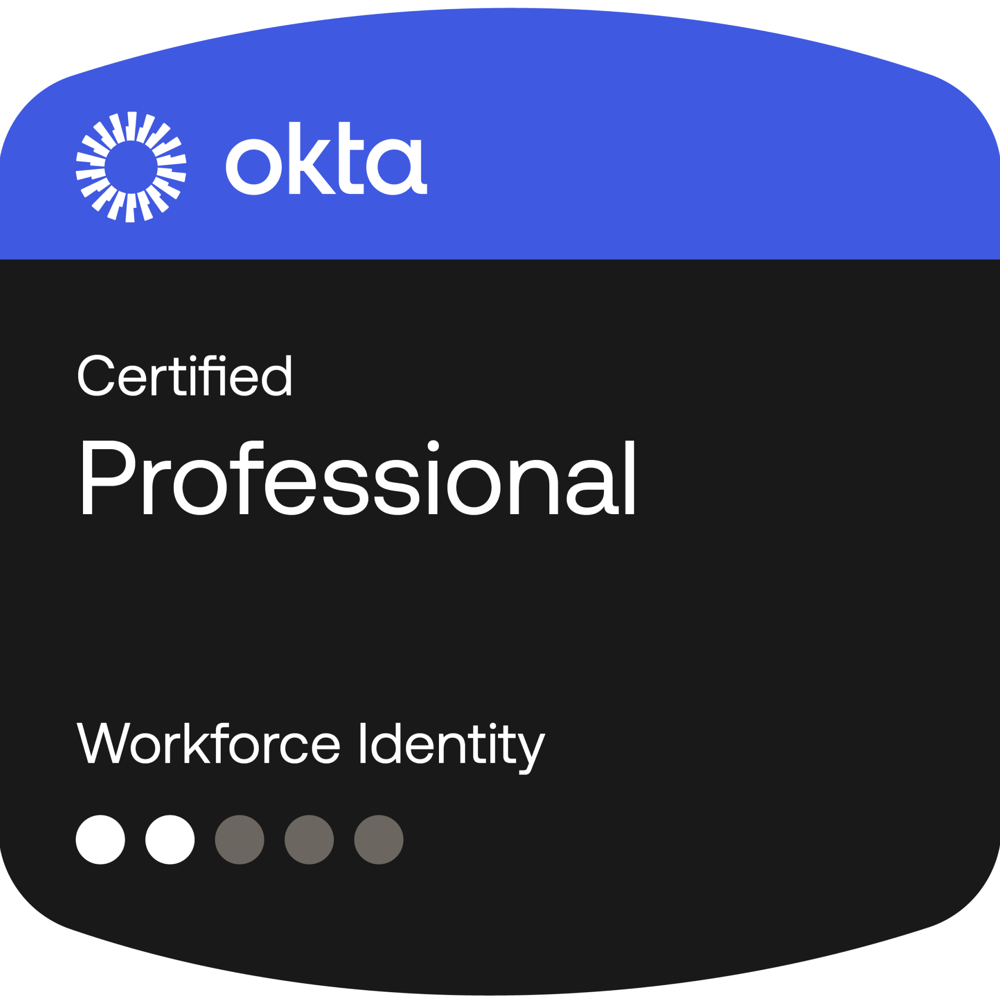
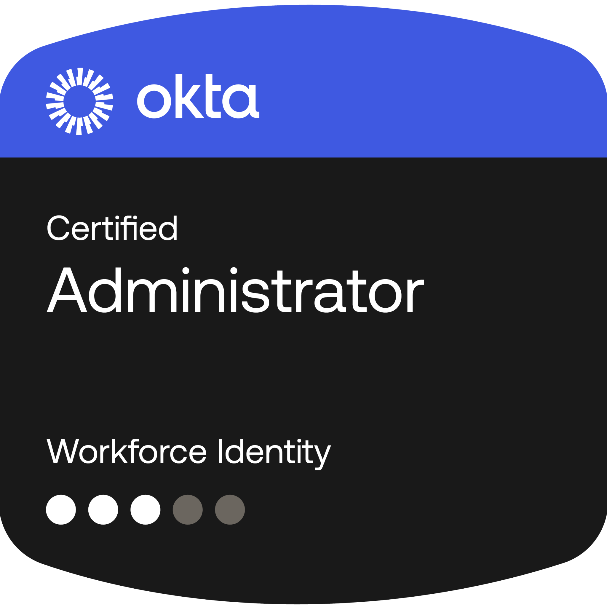

## Hi, im Nikolas! 👋 ##

I'm a Computer Science student at John Jay College of Criminal Justice with a strong interest in cybersecurity — specifically Identity and Access Management (IAM), data security, and cloud infrastructure.

I am doing IAM projects and labs focused on platforms like Microsoft Azure and AWS, virtual machine deployment, identity monitoring, user creation automation, authentication configuration, and role-based access control using Microsoft Entra ID.

I am working toward a career in cloud securitym IAM engineering, or other IAM roles. My current focus is strengthening my foundations in IT fundamentals, cloud services, access management, automation, and security — while building my portfolio through hands-on projects and labs.

## Certifications ##

